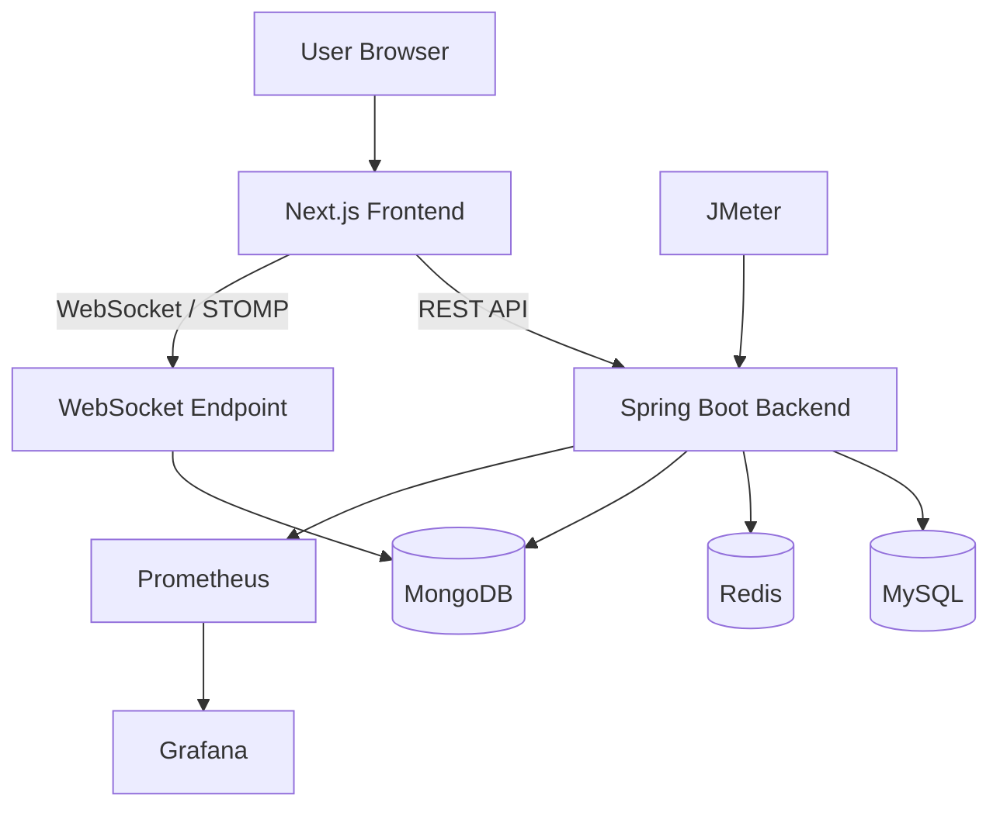
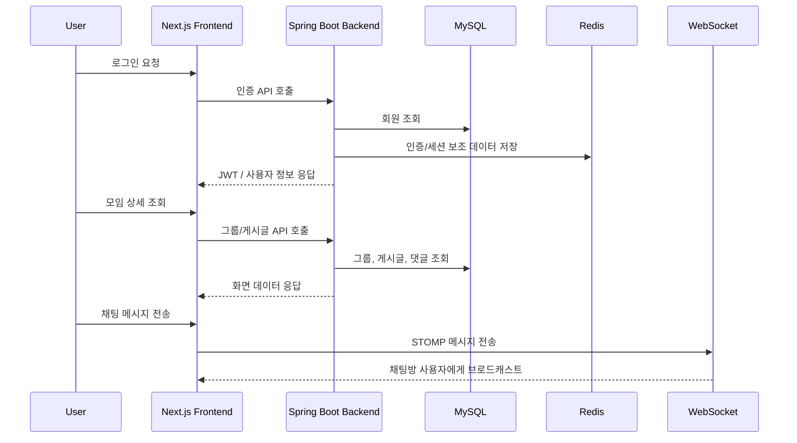
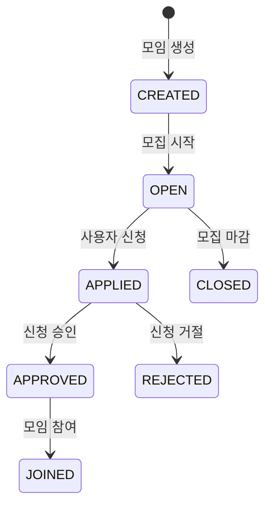

# Linkus

> 관심사 기반 모임과 게시글, 채팅, 신청 기능을 제공하는 풀스택 웹 서비스입니다.

Linkus는 사용자가 관심사에 맞는 모임을 만들고, 게시글을 작성하며, 모임 신청과 실시간 채팅을 통해 사람들과 연결될 수 있도록 만든 웹 서비스입니다. 백엔드는 Spring Boot, 프론트엔드는 Next.js 기반으로 구성되어 있으며 Redis, MongoDB, WebSocket, JWT/OAuth2, Prometheus/Grafana, JMeter를 활용합니다.

---

## 1. 프로젝트 개요

일반적인 커뮤니티는 게시글 중심으로 끝나는 경우가 많습니다. Linkus는 게시글, 모임, 신청, 댓글, 첨부파일, 채팅을 하나의 흐름으로 연결하여 사용자가 온라인에서 관심사를 발견하고 실제 모임 참여까지 이어질 수 있도록 설계한 프로젝트입니다.

### 주요 목표

- 관심사 기반 그룹/모임 생성
- 게시글과 댓글을 통한 커뮤니티 기능 제공
- 모임 신청 및 참여 관리
- 실시간 채팅 기능 제공
- JWT/OAuth2 기반 인증 처리
- Redis 기반 캐싱/임시 데이터 처리
- MongoDB 기반 채팅 데이터 저장 확장
- Prometheus/Grafana 기반 모니터링 구성
- JMeter 기반 성능 테스트 환경 구성

---

## 2. 기술 스택

### Backend

| 구분 | 기술 |
|---|---|
| Language | Java 17 |
| Framework | Spring Boot 3.4.1 |
| Build | Gradle Kotlin DSL |
| Persistence | Spring Data JPA |
| Database | MySQL, H2 |
| Query | QueryDSL |
| Cache | Redis |
| Document DB | MongoDB |
| Realtime | WebSocket, STOMP |
| Security | Spring Security, OAuth2 Client, JWT |
| API Docs | SpringDoc OpenAPI / Swagger UI |
| Monitoring | Spring Actuator, Micrometer, Prometheus, Grafana |
| Test | JUnit, Spring Security Test, Jacoco, JMeter |
| Etc | Lombok, Validation, WebFlux, dotenv |

### Frontend

| 구분 | 기술 |
|---|---|
| Framework | Next.js 15 |
| Language | TypeScript |
| UI | React 19, Tailwind CSS, Radix UI, lucide-react, FontAwesome |
| State / Server State | TanStack Query |
| HTTP Client | Axios |
| Realtime | STOMP.js, SockJS |
| Styling Utils | clsx, tailwind-merge, tailwindcss-animate |

---

## 3. 프로젝트 구조

```text
Linkus
├── backend
│   ├── Dockerfile
│   ├── docker-compose.yml
│   ├── prometheus.yml
│   ├── build.gradle.kts
│   └── src
│       ├── main
│       │   ├── java/com/app/backend
│       │   │   ├── BackendApplication.java
│       │   │   ├── domain
│       │   │   │   ├── attachment
│       │   │   │   ├── category
│       │   │   │   ├── chat
│       │   │   │   ├── comment
│       │   │   │   ├── group
│       │   │   │   ├── meetingApplication
│       │   │   │   ├── member
│       │   │   │   └── post
│       │   │   └── global
│       │   │       ├── annotation
│       │   │       ├── aop
│       │   │       ├── config
│       │   │       ├── dto/response
│       │   │       ├── entity
│       │   │       ├── error
│       │   │       ├── init
│       │   │       ├── module
│       │   │       ├── redis
│       │   │       └── util
│       │   └── resources
│       │       ├── application.yml
│       │       ├── config
│       │       └── static
│       └── test
│
└── frontend
    ├── Dockerfile
    ├── package.json
    ├── next.config.ts
    ├── tailwind.config.ts
    └── src
        ├── api
        ├── app
        ├── components
        ├── lib
        ├── stores/auth
        ├── types
        └── api.ts
```

---

## 4. 전체 아키텍처



---

## 5. 핵심 도메인

| 도메인 | 설명 |
|---|---|
| `member` | 회원 정보, 인증 사용자 관리 |
| `group` | 관심사 기반 모임/그룹 관리 |
| `meetingApplication` | 모임 신청 및 참여 상태 관리 |
| `post` | 게시글 작성/조회/수정/삭제 |
| `comment` | 게시글 댓글 |
| `category` | 게시글/모임 분류 |
| `attachment` | 첨부파일 관리 |
| `chat` | 실시간 채팅 및 메시지 관리 |

---

## 6. 주요 기능

### 회원/인증

- JWT 기반 인증 처리
- OAuth2 Client 기반 소셜 로그인 확장
- Spring Security 기반 인증/인가
- 인증 상태를 프론트엔드에서 관리

### 그룹/모임

- 관심사 기반 그룹 생성
- 그룹 목록/상세 조회
- 그룹 참여 신청
- 신청 상태 관리

### 게시글/댓글

- 게시글 작성, 조회, 수정, 삭제
- 카테고리 기반 게시글 분류
- 댓글 작성 및 관리
- 첨부파일 업로드 구조

### 채팅

- WebSocket/STOMP 기반 실시간 메시지 송수신
- SockJS 기반 브라우저 호환성 확보
- MongoDB 기반 메시지 저장 구조 확장

### 모니터링/성능 테스트

- Spring Actuator + Micrometer + Prometheus 메트릭 수집
- Grafana 대시보드 연동 가능
- JMeter 컨테이너를 통한 성능 테스트 환경 구성

---

## 7. 사용자 흐름



---

## 8. 모임 신청 흐름



---

## 9. 실행 방법

### Backend 실행

```bash
cd backend
./gradlew clean build
./gradlew bootRun
```

Windows 환경:

```bash
cd backend
gradlew.bat clean build
gradlew.bat bootRun
```

### Frontend 실행

```bash
cd frontend
npm install
npm run dev
```

프론트엔드 기본 접속 주소:

```text
http://localhost:3000
```

백엔드 기본 접속 주소:

```text
http://localhost:8080
```

---

## 10. Docker Compose 실행

백엔드 디렉터리에는 다음 컨테이너 실행 구성이 포함되어 있습니다.

- Spring Boot App
- Redis
- Prometheus
- Grafana
- JMeter

```bash
cd backend
docker network create monitoring
docker compose up -d --build
```

컨테이너 접속 포트 예시:

| 서비스 | 포트 |
|---|---|
| Spring Boot | `8080` |
| Redis | `6379` |
| Prometheus | `9090` |
| Grafana | `3100` |

---

## 11. 환경 변수 예시

`.env` 파일 또는 배포 환경 secret으로 관리하는 것을 권장합니다.

```env
DB_URL=jdbc:mysql://localhost:3306/linkus
DB_USERNAME=root
DB_PASSWORD=password
JWT_SECRET=change-me
REDIS_HOST=localhost
REDIS_PORT=6379
MONGODB_URI=mongodb://localhost:27017/linkus
OAUTH_CLIENT_ID=your-client-id
OAUTH_CLIENT_SECRET=your-client-secret
```

---

## 12. API 문서

SpringDoc OpenAPI가 포함되어 있으므로 백엔드 실행 후 Swagger UI를 통해 API를 확인할 수 있습니다.

```text
http://localhost:8080/swagger-ui/index.html
```

---

## 13. 테스트 및 모니터링

### 백엔드 테스트

```bash
cd backend
./gradlew test
```

테스트 실행 후 Jacoco 리포트가 생성됩니다.

```text
backend/build/reports/jacoco/test/html/index.html
```

### Prometheus / Grafana

```text
Prometheus: http://localhost:9090
Grafana:    http://localhost:3100
```

### JMeter

`backend/jmeter` 디렉터리에 테스트 플랜을 두고 `docker compose`를 실행하면 JMeter 컨테이너 기반 성능 테스트를 수행할 수 있습니다.

---

